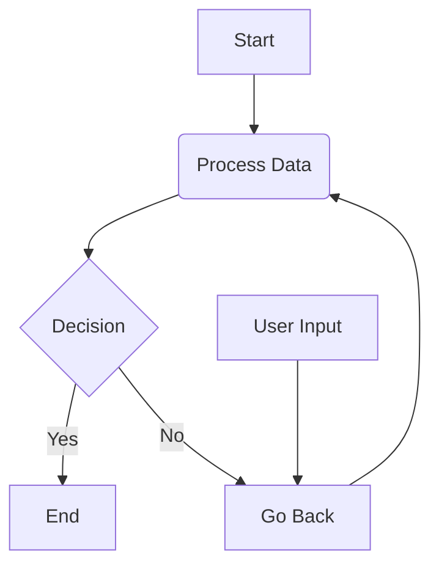

# **_🧑‍💻PROGRAMMING CONCEPT👩‍💻_**

## ⭐The key to mastering any programming language is knowing how to work with data — understanding Type-checking, transforming, and manipulating( serializing, Parsing (De-serializing)) all types of data structures like **_(Primitive, Non-primitive and User-defined/abstract Datatypes)⭐_**

### **[🔗DataTypes](./programming-langs/datatypes.md)**

> ## **Language-Agnostic Thinking**
>
> ```text
> Knowing the concept is more important than knowing the Syntax
> ```

### **[🔗 Types of Programming Langs](./programming-langs/typesofprogramminglangs.md)**

---

## 🚀 Core Concepts

1. ### **[🔗OOPS Concept](./programming-langs/oops.md)**

2. ### **[🔗🌐Rest API Concept](./rest%20api/restapi.md)**

### **☁️ DevOp**

- **[🔗Docker Concept](./DevOp/docker/docker.md)**

### **🔐 Security**

1. **[🔗 Security](./security/security.md)**

### **📦 Other Concepts**

1. **[🔗Dotenv Concept](./Other%20Concepts/dotenv/dotenvconcepts.md)**
2. **[🔗Mail Concept](./Other%20Concepts/mail/mail.md)**

<details>
<summary>Dropdown Title</summary>

- Dropdown content goes here. It can contain text, lists, and even code blocks.

</details>


