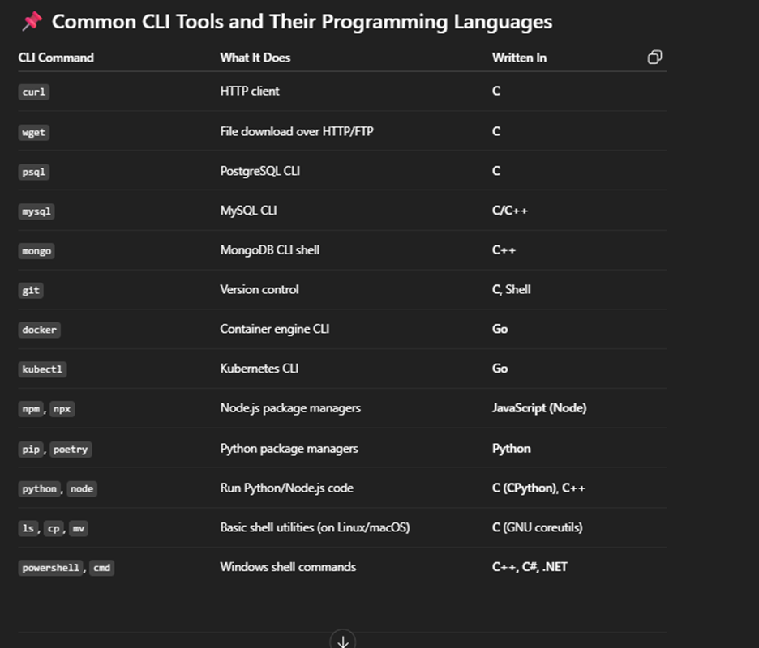

# **CLI Concepts**

## **Different command-line interfaces (CLIs) or terminal emulators**

### 1. **Windows Command Prompt (CMD): -** _In window we have mainly Three type of shells `bat, cmd and powershell`_

- [🔗More on Windows CLIs](./window-cli/window-cli.md)

### 2. **Unix-based CLIs: -** _In unix based OS like linux(Bash) , macOS(Zsh) and WSL **.sh** for shell files_

- [🔗 More on unix-based CLIs](./unix-based-cli/unix-based-cli.md)

🔗
[More on Different CLIs](./unix-based-cli/unix-based-cli.md)
