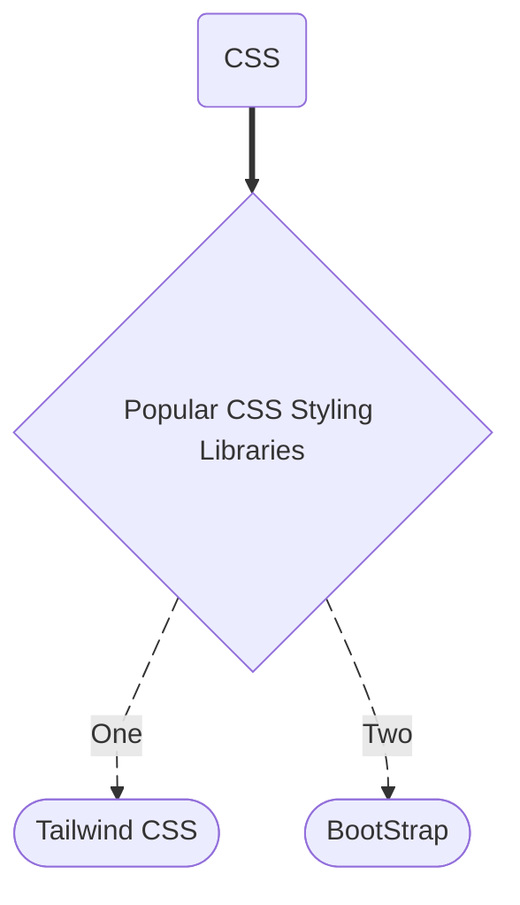

# **CSS**

> The key to master is CSS, is knowing to create any kind of responsive layouts using both **Grid and Flex property**

## **Position: -** We have 5 types of Positioning in CSS

1. Fixed
2. Relative
3. Absolute
4. Sticky
5. Static (defualt)

>NOTE: - Whenever we use `left`, `right`, `bottom` and `top`, it does not means towards them, it means away from them.

## **Flex**

1. **Flex**: `flex` is a shorthand for (flex-grow + flex-shrink + flex-basis)

   - flex-basis
   - flex-shrink
   - flex-grow

2. **Types of Alignment in Flexbox**
   - justify-content
   - align-items
   - align-content
   - align-self

## **Grid**

## **[🔗 Animations](./animationincss.md)**
