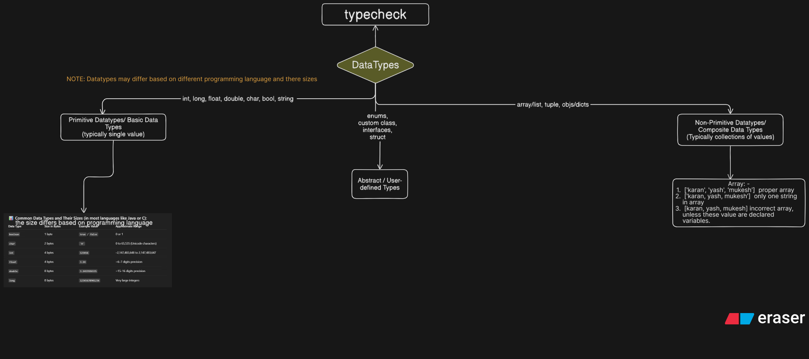

# **DataTypes**

```text
The key to mastering any programming language is knowing how to work with data — understanding, transforming, and manipulating all types of data structures and types.
```

> ## **_Datatypes Flow Diagram⬇️_**



- NOTE: Datatypes differs based on different programming language and there sizes

## **TypeCheck**

There are two types of programming language: -

1. Statically Typed Programming language: - java, c , c++, go, rust, ts, kotin etc
2. Dynamically Typed Programming language: - python, js, php etc
