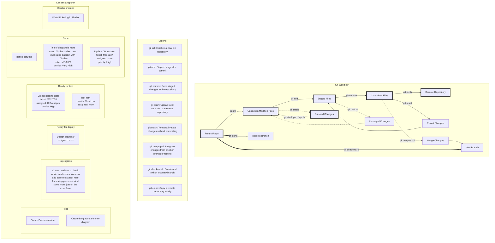

```mermaid
flowchart TD
    subgraph Graph[Git Workflow]
        A[Project/Repo] -->|git init| B[Untracked/Modified Files]
        B -->|git add| C[Staged Files]
        C -->|git commit| D[Committed Files]
        C -.->|git restore| I[Unstaged Changes] -.-> B
        D -->|git push| E[Remote Repository]
        D -->|git reset| G[Revert Changes] --> C

        %% Optional actions
        B -.->|git stash| F[Stashed Changes]
        F -.->|git stash pop / apply| B

        D -.->|git merge / pull| H[Merge Changes]--> J

        A ==>|git checkout -b| J[New Branch]
        A ==>|git clone| K[Remote Branch]

        style A stroke:#333,stroke-width:4px
        style B stroke:#333,stroke-width:4px
        style C stroke:#333,stroke-width:4px
        style D stroke:#333,stroke-width:4px
        style E stroke:#333,stroke-width:4px
        style F stroke:#333,stroke-width:4px
    end

    subgraph Legend
        L1[git init: Initialize a new Git repository]
        L2[git add: Stage changes for commit]
        L3[git commit: Save staged changes to the repository]
        L4[git push: Upload local commits to a remote repository]
        L5[git stash: Temporarily save changes without committing]
        L6[git merge/pull: Integrate changes from another branch or remote]
        L7[git checkout -b: Create and switch to a new branch]
        L8[git clone: Copy a remote repository locally]
    end

    subgraph Kanban[Kanban Snapshot]
        direction LR
        subgraph TodoCol[Todo]
            Todo1[Create Documentation]
            Todo2[Create Blog about the new diagram]
        end
        subgraph InProgressCol[In progress]
            IP1[Create renderer so that it works in all cases. We also add some extra text here for testing purposes. And some more just for the extra flare.]
        end
        subgraph ReadyDeployCol[Ready for deploy]
            RD1[Design grammar\nassigned: knsv]
        end
        subgraph ReadyTestCol[Ready for test]
            RT1[Create parsing tests\nticket: MC-2038\nassigned: K.Sveidqvist\npriority: High]
            RT2[last item\npriority: Very Low\nassigned: knsv]
        end
        subgraph DoneCol[Done]
            Done1[define getData]
            Done2[Title of diagram is more than 100 chars when user duplicates diagram with 100 char\nticket: MC-2036\npriority: Very High]
            Done3[Update DB function\nticket: MC-2037\nassigned: knsv\npriority: High]
        end
        subgraph CantReproCol[Can't reproduce]
            CR1[Weird flickering in Firefox]
        end
    end
```
