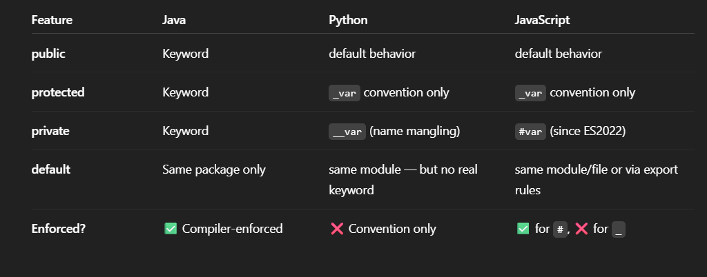
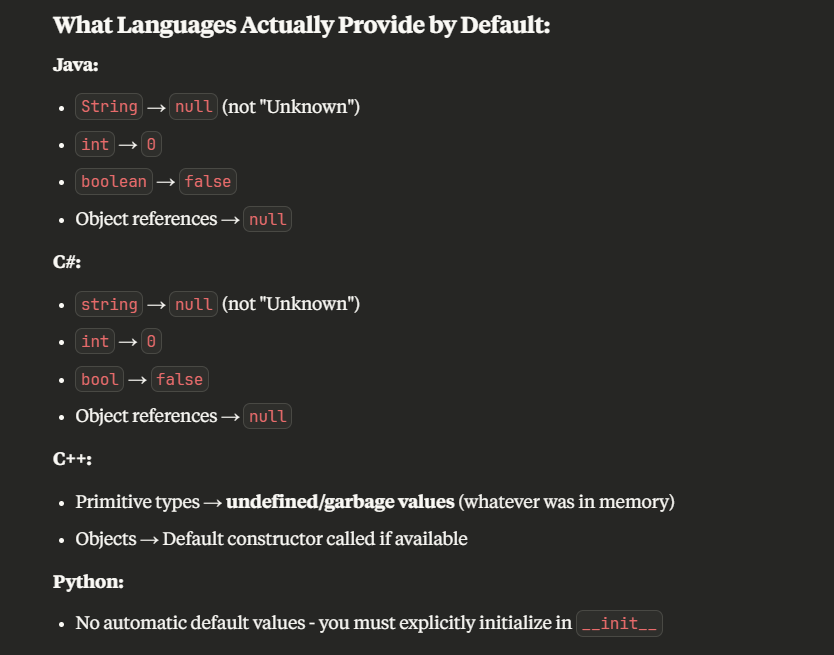

# **_Object oriented Programming(OOPS)_**

```text
Object-Oriented Programming (OOP) is a programming paradigm based on the concept of "objects", which can hold data (fields) and methods (functions/behaviors) that operate on the data.
```

- The term "Object-Oriented" comes from the fundamental concept that this programming paradigm is built around objects as the primary building blocks of software or **"objects" as the fundamental building blocks of a program/ Software.**
- **Truely OOPS Programming language** are java, c# , c++ and some more

> ## **Class = Template/Blueprint⬇️**

```java
//Class eg in java
public class User {
    //fields/attributes/properties
    String name;
    int age;

    //parameter Constructor
    public User(String name, int age) {
        this.name = name;
        this.age = age;
    }

    // Method
    public void greet() {
        System.out.println("Hi, my name is " + name + " and I am " + age + " years old.");
    }
}
```

Class is template/ blueprint that is **used to create/inatialize an object** will all or the specific **Attributes/Properties/Fields** and **Methods/Functions** based on our constructor , when we create new object using new keyword ??

- What **data an object** will have (fields/attributes/properties)
- What **behaviors an object** can perform (methods)
- How **objects are initialized** (constructors)

> ## **Object = Instance Created from the Class Blueprint⬇️**

```java
//obj initialization in java using class blueprint
User user1 = new User("Karan", 24); //now here user1 is a object with tow property name and age.
user1.greet();
// output = Hi, my name is Karan and I am 24 years old.
```

- Uses the constructor → to pass "Karan" and 24.
- Allocates memory → for a new User object.
- Initializes fields → name = "Karan", age = 24.
- Returns the object reference → assigned to user1.

When we use the new keyword with a constructor, you're essentially saying: **_Build me an actual object based on this class blueprint._**

> ## **_Access Modifiers⬇️_**

Access modifiers are keywords that define the visibility/scope of classes, methods, constructors, and fields (variables).



1. **(default)/ Package-private: -** Accessible only within the same package
2. **private: -** Accessible only within the same class
3. **protected: -** Accessible in same package + subclasses
4. **public: -** Accessible from anywhere

> ## **Constructor**

- A constructor is a special method used to **initialize objects** when you use new. It serves as the **initialization mechanism** for objects, setting up their initial state/values for instance variables and preparing them for use
- **_Constructors have the same name as the class they belong to._** They **don't have a return type**, not even void, because they **implicitly return the newly created object**

### **Types of Constructor: -**

1. Default/No-Arg/parameterless Constructor: - Takes no parameters and initializes objects with default values. If you don't define any constructor, **many languages provide a default one automatically.**
   

   - Java & Kotlin & c# provide safe defaults (0, false, null).

   - JavaScript and Python use undefined or None, so null-checking is essential.

   - C++ leaves primitives uninitialized by default — risky without initialization.

   ```java
    // no-arg contructor example
   public class User {
    String name;
    int age;

    // No-arg constructor
    public User() {
        // no fields/attributes/properties initialization
    }
    }

   ```

   ```java
   // instialization
   User u = new User();
   // usage manually setting value like this
    u.name = "Karan";
    u.age = 24;
   ```

2. Parameterized Constructor: - Accepts parameters to initialize objects with specific values provided during creation. This allows for customized object initialization.

   ```text
   top class and object initialization example
   ```

   [See this example, for paramter Constructor](#class--templateblueprint️)

3. Copy Constructor (Custom): - Creates a new object as a copy of an existing object. This is particularly important for deep copying when objects contain references to other objects.

### **Private Constructor**

A private constructor is a No one outside the class can create/initialize objects directly. Only the class itself can create its instance

- No other class can create an object using **new ClassName().**
- Only the **class itself can create instances internally**.
- Provides controlled access through static methods, which can only be accessed using that class name only.

so when we make the private construction, we left with two appraoch: -

1. **Singleton Pattern: -** The Singleton pattern is a design pattern that ensures a class has only one instance and provides a global point of access to that instance. This is useful for resources that should be unique in a system, such as:

   - Database connections (expensive to create multiple)
   - Configuration managers
   - Logging services
   - Cache managers
   - Thread pools

   ```java
   public class Singleton {

       private static Singleton instance;

       // Private constructor — now no one can call `new Singleton()`
       private Singleton() {}

       // Public method to access the one instance
       public static Singleton getInstance() {
           if (instance == null) {
               instance = new Singleton();
           }
           return instance;
       }
   }
   ```

   ```java
   Singleton s1 = Singleton.getInstance();
   Singleton s2 = Singleton.getInstance();

   System.out.println(s1 == s2); // true → same object
   ```

2. **Factory Methods: -** Factory methods (often called **"Static Factory Methods"** when they are **static methods within the class itself**) are static methods that return an instance of the class (or a subclass). When combined with private constructors, they provide a much more flexible and descriptive way to **create objects** than direct constructor calls.

   ```java
   public class User {

       private String role;

    //private constructor
       private User(String role) {
           this.role = role;
       }

    // static method
       public static User createAdmin() {
           return new User("ADMIN"); // object created here using private constructor
       }

    // static method
       public static User createGuest() {
           return new User("GUEST"); // object created here using private constructor
       }

       @Override
       public String toString() {
           return "User{role='" + role + "'}";
       }
   }
   ```

   ```java
    User admin = User.createAdmin();
    User guest = User.createGuest();
    System.out.println(admin); // User{role='ADMIN'}
   ```

## **Contructor Overloading**

## **4 Pillars of Object-Oriented**

1. Encapsulation:- Bundling data (attributes) and the methods that operate on that data within a single unit (the object), and hiding the internal details from the outside world.
2. Abstraction: - Showing only the essential features of an object and hiding the complex implementation details. It's about designing objects that present a simplified view to the outside.
3. Polymorphism: - The ability of an object to take on many forms. Specifically, it allows objects of different classes to be treated as objects of a common base class. This often involves method overriding, where a subclass provides its own specific implementation of a method defined in its superclass.
4. Inheritance: - A mechanism where one class (subclass/child class) can inherit properties and behaviors from another class (superclass/parent class). This creates a "is-a" relationship

   - ### **Types of Inheritance**
