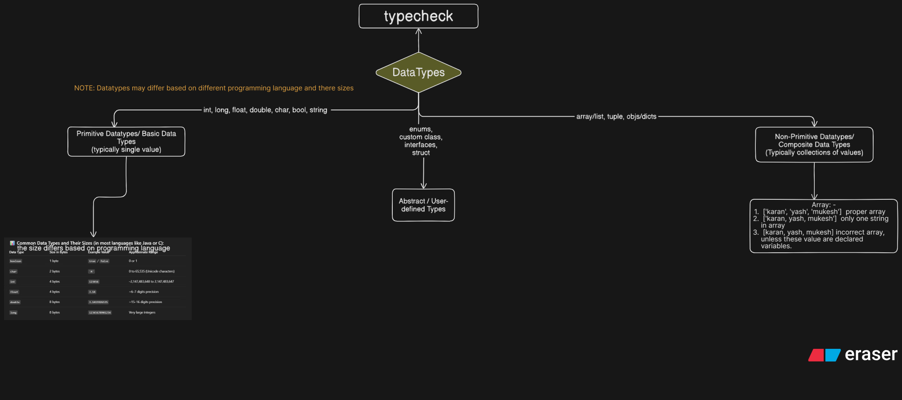

# **DataTypes**

```text
The key to mastering any programming language is knowing how to work with data — understanding, transforming, and manipulating all types of data structures and types.
```

> ## **_Datatypes Flow Diagram⬇️_**



## **Primitive VS Non-Primitive VS User-Defined Datatypes**

> ⭐ The concept of primitive vs non-primitive data types is `language-dependent`. Different languages define them differently based on `how they manage memory, data, and types.`

### **Key Factors That Cause the Difference: -**

- `Memory Management: -`
  1. **Stack Allocation: -** Primitive Types **Are generally stored directly in memory** where the variable is allocated (on the stack).
  2. **Heap Allocation: -** Non-Primitive Types (Reference Types): **The variable does not hold the actual data but instead holds a reference or a pointer** (a memory address) to the object's actual location in memory (on the heap). This allows for more complex data structures.
- `Immutability: -` **Primitive types are often immutable**, meaning their value cannot be changed once created. In contrast, **non-primitive objects are often mutable**.
- `Built-in Status: -` Primitive types are the most basic **data types built directly into the language**. **Non-primitive types are often constructed from primitive types or other non-primitive types** (e.g., an array is a collection of other types)

1. **Primitive Datatypes**

   - `ℹ️Ques: - Why do we even call these DataTypes as Primitive ?`
     - "Primitive" = Basic, fundamental, first level.
     - Holds a single, indivisible value.
     - Built-in to the language
     - Variable holds the actual value.
     - Passed by value (a copy is made).

   1. Number
   2. String

2. **Non-Primitive Datatypes**

   - `ℹ️Ques: - Why do we even call these DataTypes as Non-Primitive ?`
     - "Non-Primitive" = Complex, derived, built upon primitives.
     - Can hold multiple values; a collection of data.
     - Often user-defined (or complex built-ins like Array).
     - Variable holds a reference (memory address) to the value.
     - Passed by reference (both variables point to the same data).

   ### **Types of Brackets we have: -**

   1. **Parentheses ( ) : -**

   - In python, data in brackets like ("name", "age", "gender") **represents tuple**

   2. **Square Brackets [ ] : -**

   ```sh
      array = ["karan", "mark", "peter", "abhi", "yoon"]
      # indexfromFront starts ts from 0
      # indexfromBack starts from -1
   ```

   - `Types of Array: -`

     1. **Homogeneous Array: -** All data in this type of array are of same type
     2. **Heterogeneous array: -** This type of array includes mixed data of different types, it can string, number , boolean, object, array, nested array, nested object etc
     3. **Multidimensional array: -** Matric type array

   - _In programming square bracket generally represents array like in js and py_
     - [🔗 Array in js](../jsANDts/jslang/dataManupulationinjs/arrayinjs.js)
     - [🔗 Array in py](../py/pylang/dataManupulationinpy/listinpy.py)

   3. **Curly Brackets { } : -**

   - _In programming curly bracket generally represents object like in js and py_
     - [🔗 Object in js](../jsANDts/jslang/dataManupulationinjs/objectinjs.js)
     - [🔗 Object in py](../py/pylang/dataManupulationinpy/dictionaryinpy.py)

   4. **Angle Brackets < > : -**

   - _Used in HTML/XML tags, template parameters (C++), and some mathematical or technical notations_

3. **User-Defined Datatypes**

### **Some Examples of Diffrent Datatypes in different Programming language: -**

- `String in Non-primitive in c++ and java`: - Because String in c++ and java are `built from the Char Primitive.`
- ***
