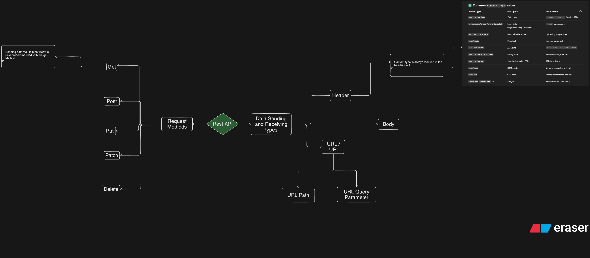

# **_Rest(Representational State Transfer) API Concept_**

```text
Technically, we can perform any action with any HTTP method, but each method has a specific purpose in REST design — for semantic clarity, consistency, and often security
```

## **http CLients Used In Different Programming Languages⬇️**


### REST is a design philosophy, not a technical requirement. We follow it because it makes APIs: -

1. Predictable for developers
2. Safe for automated systems
3. Compatible with HTTP infrastructure
4. Self-documenting through method semantics

### Infrastructure Behavior: -

- Caches only cache GET/HEAD by default
- Proxies may handle methods differently
- Firewalls may block certain methods
- Browsers have different behavior (CORS preflight for PUT/DELETE)

## **🔗[rfc HTTP DOCS](https://datatracker.ietf.org/doc/html/rfc7231)**

## **🔗[Mozilla HTTP DOCS](https://developer.mozilla.org/en-US/docs/Web/HTTP)**

> ## **_Rest API Flow Diagram ⬇️_**



---

### **Request and Response⬇️**

1. **HTTP Request Structure: -** _Http Request made to any server_

   - URL/Path
   - Method (GET, POST, PUT, DELETE, etc.)⭐
   - Request Headers
   - - Host:
   - - Authorization:
   - - Content-Type:
   - - User-Agent:
   - - Accept:
   - - Connection:
   - - Content-Length:
   - - custom header also
   - Request Body(Optional - mainly for POST/PUT) (Content in py)
   - - contains the actual data that we send

   ```js
   // sending request with fetch
   fetch("https://karan.email?name=karan&age=22", {
     method: "POST",
     headers: {
       "Content-Type": "application/json",
       authorization: "Bearer your_token_here",
     },
     body: JSON.stringify({
       name: "Karan",
       age: 22,
     }),
   });
   ```

   ```js
   // sending request with axios
   axios.post(
     "https://karan.email?name=karan&age=22",
     { // data sending via body
       name: "Karan",
       age: 22,
     },
     {
      // in axios data via param can also be send like this⬇️
      params : {
         name: "karan",
         age: 22
      }
       headers: {
         "Content-Type": "application/json",
         Authorization: "Bearer your_token_here",
       },
     }

   );
   ```

   ```py
   # sending request with python requests
   import requests

   response = requests.post(
      "https://karan.email?name=karan&age=22",
      # in python also we can send data via url query like this also like axios⬇️
      params={"name": "karan", "age": 22},  url query
      json={"name": "Karan", "age": 22}, # data sending via body
      headers={
         "Content-Type": "application/json",
         "Authorization": "Bearer your_token_here"
      }
   )
   ```

2. **HTTP Response Structure: -** _Http Response recceived from the server_

   - Status Code (200, 404, 500, etc.)⭐: - this receives the status code, sent by the response from the server
   - - Status Message (Optionally like in node.js)
   - Response Headers (Metadata)
   - - url
   - - Content-Type:
   - - Content-Lenght
   - - Set-Cookie:
   - - Cache-Control:
   - - Server:
   - - Date:
   - - custom header also
   - Request Body ("Content" in py): - this receives the data, sent by the response from the server
   - - contains the actual data that we receive from the server/backend

   ```js
   // http response sending example in node.js/express
   async test(req: Request, res: Response): Promise<void> {
    try {
      const response = await Service.test();
      if (response) {
        res.status(response.statusCode).json(response);  // So here we are sending the custom status code to request use res.status method in response. now the reponse received by the request will show this status code.
        // # and in  body via .json method in response we sending the actual data, now the response received by the request will so this so this data in body/ content.
      }
      //ℹ️ In Express, we must use res to send the response to the client — we cannot return custom data from the controller method itself cause it ❌ Has no effect on the HTTP response. and the request will hang until Express times out or sends an empty default response. That’s because Express route handlers don't work with return statements for sending responses. The res object is how Express communicates back to the client
    } catch (error: unknown) {
      res
        .status(500)
        .json({ error: error instanceof Error ? error.message : 'An unknown error occurred' });
    }
   }
   ```

   ```py
   # http response sending example in python fastapi
   from fastapi import Response

   @router.get("/test")
   async def test_route(name: str) -> Response:
      res: ApiResponse = Service.test(name)
      return Response(
         content=res.model_dump_json(), # here in content we sending the actual data, now the response received by the request will so this data in body/content.
         status_code=res.status_code, # So here we are sending the custom status code to request. now the reponse received by the request will show this status code.
         media_type="application/json", # optional
      )
      #ℹ️ In FastAPI, unlike Express.js, we can return any data directly, and FastAPI automatically converts it into a proper HTTP response behind the scenes, but if we send/ returned some custom data, not within the Http response, then in that case the status code to request will be automatically assigned(Mostly 200 status code), not in our control

   ```
