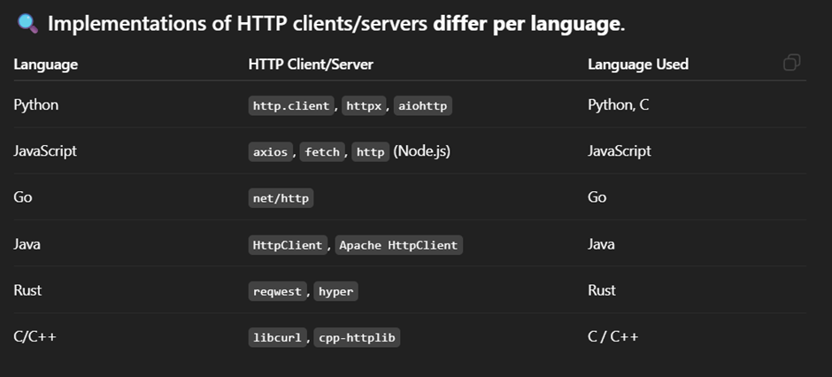

# **_Rest API Concept_**

```text
Technically, we can perform any action with any HTTP method, but each method has a specific purpose in REST design — for semantic clarity, consistency, and often security
```

## **🔗[rfc HTTP DOCS](https://datatracker.ietf.org/doc/html/rfc7231)**

## **http CLients Used In Different Programming Languages⬇️**



## **🔗[Mozilla HTTP DOCS](https://developer.mozilla.org/en-US/docs/Web/HTTP)**

> ## **_Rest API Flow Diagram ⬇️_**


### Some Rules of Rest API: -

1. **Request Body** is not recommended with **_Get_** and **_Delete_** Method
2. Never use Get for any **Server Side action** and For **any sensitive data**

---

### REST is a design philosophy, not a technical requirement. We follow it because it makes APIs: -

1. Predictable for developers
2. Safe for automated systems
3. Compatible with HTTP infrastructure
4. Self-documenting through method semantics

### Infrastructure Behavior: -

- Caches only cache GET/HEAD by default
- Proxies may handle methods differently
- Firewalls may block certain methods
- Browsers have different behavior (CORS preflight for PUT/DELETE)
