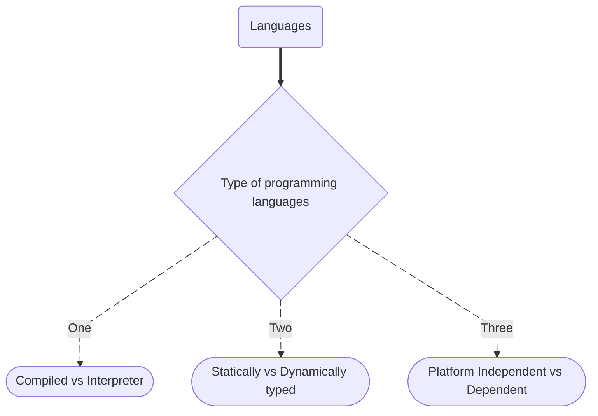

# **Types of Programming Langs**

## **Interpreter vs Complied Language**

| Feature             | **Interpreter**                          | **Compiler**                                             |
| ------------------- | ---------------------------------------- | -------------------------------------------------------- |
| 🔄 Execution        | Executes code **line-by-line**           | Translates entire code **at once** into machine code     |
| 🕒 Speed (Run time) | Slower (interprets every time)           | Faster (compiled once, runs many times)                  |
| ⚠️ Error Handling   | Stops at the **first error**             | Shows **all errors after compilation**                   |
| 🧪 Use Case         | Scripting, dynamic coding (e.g., Python) | Performance-critical software (e.g., games, system apps) |
| 🔤 Output           | No separate file — runs directly         | Produces an executable file (e.g., `.exe`)               |
| 🧰 Examples         | Python, JavaScript, PHP, Ruby, Node.js   | C, C++, Rust, Go, Java\*                                 |

---

## **Platform Independent VS Platform dependent**

1. **[🔗Platform dependent](../cpp/cpp.md#c-platform-dependent)**

2. **[🔗Platform Independent](../java/java.md#java-platorm-independent)**

## **Statiscally Typed vs Dynaically Typed**

### **TypeCheck**

- **[🔗TypeCheck](./typeCheck.md)**
